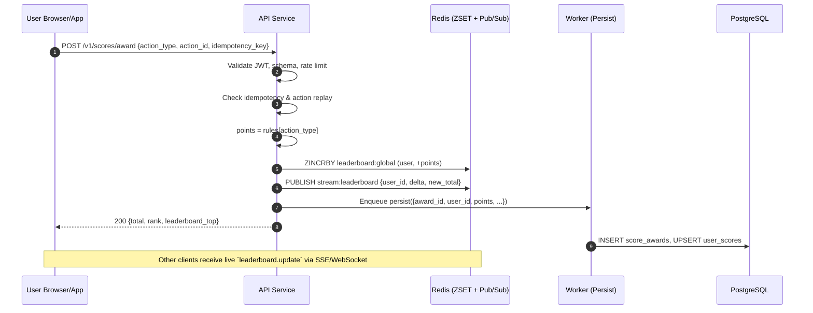
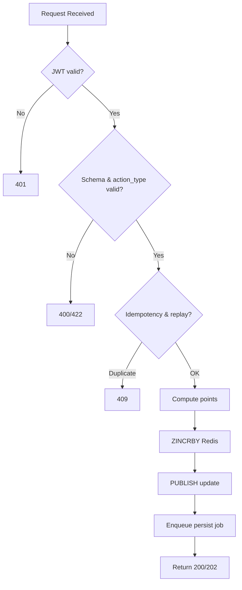

# Scoreboard API Module

**Status:** Draft → Ready for Implementation
**Owner:** Backend Platform Team
**Last updated:** 2025-09-15 (Asia/Ho\_Chi\_Minh)

## Table of Contents

- [Scoreboard API Module](#scoreboard-api-module)
  - [Table of Contents](#table-of-contents)
  - [1) Summary](#1-summary)
  - [2) Architecture Overview](#2-architecture-overview)
    - [Components](#components)
    - [Data Model (Redis)](#data-model-redis)
    - [Data Model (PostgreSQL)](#data-model-postgresql)
  - [3) API Design](#3-api-design)
    - [3.1 Award points (server‑computed)](#31-award-points-servercomputed)
    - [3.2 Read Top N leaderboard](#32-read-top-n-leaderboard)
    - [3.3 Get current user score](#33-get-current-user-score)
    - [3.4 Live updates (SSE)](#34-live-updates-sse)
  - [4) Realtime Flow \& Control Flow Diagrams](#4-realtime-flow--control-flow-diagrams)
    - [4.1 End‑to‑End Sequence](#41-endtoend-sequence)
    - [4.2 Award Endpoint Logic](#42-award-endpoint-logic)
  - [5) Security \& Anti‑Abuse](#5-security--antiabuse)
  - [6) Consistency \& Performance](#6-consistency--performance)
  - [7) Configuration \& Rules](#7-configuration--rules)
  - [8) Persistence Worker](#8-persistence-worker)
  - [9) Observability](#9-observability)
  - [10) OpenAPI (excerpt)](#10-openapi-excerpt)
  - [11) Implementation Notes](#11-implementation-notes)
  - [12) Testing Strategy](#12-testing-strategy)
  - [13) Rollout \& Migration](#13-rollout--migration)
  - [14) Operational Runbook (abridged)](#14-operational-runbook-abridged)
  - [15) Additional Comments \& Improvements](#15-additional-comments--improvements)
  - [16) Appendix: Example Client Snippets](#16-appendix-example-client-snippets)

---

## 1) Summary

This module powers a real‑time Top‑10 scoreboard for our website. Users complete an action (details out of scope) that earns points. The client notifies the API, which validates authorization and anti‑abuse controls, updates the user’s score atomically, and broadcasts leaderboard changes live to connected clients.

**Design highlights**

* **Data model:** Redis Sorted Set for hot leaderboard operations; PostgreSQL for durable history & auditing.
* **Realtime:** Server‑Sent Events (SSE) broadcast channel (simple, HTTP‑friendly) with graceful fallback to short polling. Optional WebSocket adapter if needed later.
* **Security:** JWT auth; *server‑computed* awards (client never provides raw points), idempotent award processing, replay protection, strict rate limits, anomaly detection hooks.
* **Performance:** Sub‑10ms p50 Redis ops; O(log N + m) reads for Top‑m (m≤10); batched persistence to DB.

**Goals**

* Show Top 10 users with live updates.
* Prevent unauthorized / fraudulent score inflation.
* Provide a minimal, stable API for web & native clients.

**Non‑Goals**

* Scoring business rules themselves (we expose a rule table/config).
* Full anti‑cheat analytics UI (we provide hooks & events).

---

## 2) Architecture Overview

### Components

* **API Service (this module):** REST + SSE endpoints, authZ/authN, validation, idempotency, rate limiting.
* **Redis (cache & leaderboard):** Primary read/write path for scores & rank; Pub/Sub channel for broadcasts.
* **PostgreSQL (persistence):** Authoritative ledger of awards; snapshot of current user scores; audit.
* **Async Worker:** Persists Redis deltas to PostgreSQL; consumes audit/anti‑abuse queues.
* **Rule Engine (in‑process):** Maps `action_type` → points. Versioned config.

### Data Model (Redis)

* `leaderboard:global` — **ZSET** mapping `user:{id}` → total score.
* `user:{id}:score` — **STRING** mirror (optional) for fast profile fetch.
* `stream:leaderboard` — Pub/Sub channel for change events.

### Data Model (PostgreSQL)

```sql
-- Awarded points (immutable ledger)
CREATE TABLE score_awards (
  award_id        UUID PRIMARY KEY,
  user_id         UUID NOT NULL,
  action_type     TEXT NOT NULL,
  points          INTEGER NOT NULL CHECK (points > 0),
  idempotency_key TEXT NOT NULL UNIQUE,
  awarded_at      TIMESTAMPTZ NOT NULL DEFAULT now(),
  meta            JSONB NOT NULL DEFAULT '{}'
);

-- Current totals (derived, but kept for reporting)
CREATE TABLE user_scores (
  user_id    UUID PRIMARY KEY,
  total      BIGINT NOT NULL DEFAULT 0,
  updated_at TIMESTAMPTZ NOT NULL DEFAULT now()
);

-- Optional: anomaly flags
CREATE TABLE score_anomalies (
  anomaly_id UUID PRIMARY KEY,
  user_id    UUID NOT NULL,
  reason     TEXT NOT NULL,
  created_at TIMESTAMPTZ NOT NULL DEFAULT now(),
  details    JSONB NOT NULL
);
```

---

## 3) API Design

All endpoints are under `/v1/` and require `Authorization: Bearer <JWT>` unless noted.

### 3.1 Award points (server‑computed)

**`POST /v1/scores/award`**

**Purpose:** Record a completed action and award points. Points are computed on the server via `action_type` rules — **the client never submits raw points**.

**Request (JSON):**

```json
{
  "action_type": "watch_video",
  "action_id": "01J95V6F5H7M8…",    // client-supplied unique id for this completion
  "idempotency_key": "6f9f2e67-…"     // UUID v4 per attempt
}
```

**Headers:**

* `Authorization: Bearer <JWT>` — identifies the user.
* `Idempotency-Key: <same as body.idempotency_key>` — optional but recommended (dup guard at gateway level).

**Responses:**

* `200 OK`

  ```json
  {
    "user_id": "…",
    "total": 1234,
    "delta": 25,
    "rank": 7,
    "leaderboard_top": [
      {"user_id": "…", "total": 2345},
      … up to 10 …
    ]
  }
  ```
* `202 Accepted` — if heavy traffic triggers async persistence return (body same as 200 sans `leaderboard_top`).
* `400 Bad Request` — invalid action\_type or malformed payload.
* `401 Unauthorized` — bad/expired JWT.
* `409 Conflict` — duplicate `idempotency_key` or replayed `action_id`.
* `422 Unprocessable Entity` — action not eligible or rule disabled.
* `429 Too Many Requests` — rate‑limited (per user + IP).

**Semantics:**

* Server validates JWT → maps to `user_id`.
* Validates `action_id` + `idempotency_key` for replay protection.
* Looks up `points = rules[action_type]` (configurable; defaults secure to 0/disabled if missing).
* Atomically increments Redis ZSET (ZINCRBY) & mirrors to `user:{id}:score`.
* Emits Pub/Sub event on `stream:leaderboard`.
* Enqueues a durable job to persist award in PostgreSQL.

---

### 3.2 Read Top N leaderboard

**`GET /v1/leaderboard?limit=10`**

**Response:**

```json
{
  "entries": [ {"user_id": "…", "total": 3450}, … ],
  "as_of": "2025-09-15T08:45:00Z"
}
```

* `limit` max 50 (defaults to 10). For public page we always use 10.

---

### 3.3 Get current user score

**`GET /v1/users/me/score`**

```json
{ "user_id": "…", "total": 1234, "rank": 7 }
```

---

### 3.4 Live updates (SSE)

**`GET /v1/stream/leaderboard`** (no auth required for public global leaderboard; enable auth if private)

* **Protocol:** SSE (`text/event-stream`)
* **Events:** `leaderboard.update`
* **Payload:**

```json
{ "user_id": "…", "delta": 25, "new_total": 1234, "rank": 7 }
```

* Clients reconnect with `Last-Event-ID` for at‑least‑once delivery.

**Optional WebSocket:** `/v1/ws` → event `leaderboard.update` same schema.

---

## 4) Realtime Flow & Control Flow Diagrams

### 4.1 End‑to‑End Sequence



### 4.2 Award Endpoint Logic



---

## 5) Security & Anti‑Abuse

1. **AuthN:** JWT (RS256). Include `sub` (user\_id), `iat`, `exp`, and `jti`.
2. **AuthZ:** Only the authenticated user can award to themselves. Server ignores any `user_id` in client payloads.
3. **Server‑computed points:** Clients send only `action_type`. Points sourced exclusively from signed, versioned rules. Disable unknown `action_type` by default.
4. **Idempotency:** Require `Idempotency-Key` header (UUID). Store a short‑lived dedupe record in Redis: `idemp:{key} → hash(payload)` with TTL=24h.
5. **Replay protection:** Maintain `action:{user}:{action_id}` for 7 days — first write wins; duplicates 409.
6. **Rate limiting:** Token bucket in gateway: `30 req/min/user` and `120 req/min/IP` (tune per traffic). Separate “award” circuit‑breaker: max 10 awards/min/user.
7. **Input validation:** Strict JSON schema, positive integers only, `action_type` allowlist.
8. **Transport:** HTTPS only; HSTS; secure cookies if used. Internal service→service via mTLS.
9. **Audit log:** Append‑only `score_awards` with immutable `award_id`; include hashed user agent/IP in `meta`.
10. **Anomaly detection hooks:** Emit `award.recorded` to analytics bus with features (hourly velocity, Z‑score vs baseline). Workers can insert into `score_anomalies`.
11. **Operational controls:** Feature flags per `action_type`; emergency kill‑switch to freeze awards; admin tool to revert last N awards for a user (compensating entries).

---

## 6) Consistency & Performance

* **Atomicity:** Leaderboard updates are single Redis ZINCRBY ops → atomic per user. DB persistence is eventually consistent (< 5s target).
* **Read path:** Top‑10 = `ZREVRANGE leaderboard:global 0 9 WITHSCORES`. p50 \~ sub‑millisecond under memory residency.
* **Write path:** `ZINCRBY` O(log N). With 1M members, log2 \~ 20 — acceptable.
* **Throughput targets:**

  * Awards: 1k RPS steady, bursts to 5k RPS for 60s without loss.
  * SSE fanout: 20k concurrent clients per pod via HTTP/1.1 keep‑alive.
* **SLOs:** p50<50ms, p95<150ms for `POST /scores/award` (excluding network). Availability 99.9%/30d.
* **Backpressure:** If Redis latency > threshold, degrade responses: omit `leaderboard_top`, return `202`, and queue persistence only.
* **Cold start:** Warm Redis with `user_scores` at deploy.

---

## 7) Configuration & Rules

**Environment variables**

```
REDIS_URL=
POSTGRES_URL=
JWT_JWKS_URL=
SSE_HEARTBEAT_MS=15000
AWARD_RATE_PER_MINUTE=10
ACTION_RULES_JSON_PATH=/etc/scoreboard/rules.json
```

**Rules file (`rules.json`)**

```json
{
  "version": 3,
  "rules": {
    "watch_video": 25,
    "share_link": 5,
    "daily_login": 10
  }
}
```

* Hot‑reload on SIGHUP; unknown actions treated as disabled.

---

## 8) Persistence Worker

* Consume a queue (in‑memory or Redis stream) of award events.
* For each event: `INSERT score_awards` (ignore duplicates on unique `idempotency_key`), `UPSERT user_scores.total += points`.
* On failure, retry with exponential backoff, move to DLQ after N attempts.

---

## 9) Observability

* **Metrics (Prometheus):**

  * `score_award_requests_total{status}`
  * `score_award_points_sum`
  * `leaderboard_sse_clients`
  * `redis_latency_ms`, `db_latency_ms`
  * `rate_limit_drops_total`
* **Logs:** Structured JSON; include `award_id`, `user_id`, `idempotency_key`, `action_id`.
* **Tracing:** OpenTelemetry spans for request → Redis → DB → publish.
* **Alerts:**

  * SSE clients drop >50% in 5m.
  * Redis ops p95 > 20ms for 5m.
  * DB upsert error rate > 1%.

---

## 10) OpenAPI (excerpt)

```yaml
openapi: 3.0.3
info:
  title: Scoreboard API
  version: 1.0.0
servers:
  - url: https://api.example.com/v1
paths:
  /scores/award:
    post:
      security: [{ bearerAuth: [] }]
      requestBody:
        required: true
        content:
          application/json:
            schema:
              type: object
              required: [action_type, action_id, idempotency_key]
              properties:
                action_type: { type: string }
                action_id: { type: string }
                idempotency_key: { type: string, format: uuid }
      responses:
        '200': { description: Award applied }
        '409': { description: Duplicate or replay }
  /leaderboard:
    get:
      parameters:
        - in: query
          name: limit
          schema: { type: integer, maximum: 50, default: 10 }
      responses:
        '200': { description: Top leaderboard }
  /users/me/score:
    get:
      security: [{ bearerAuth: [] }]
      responses:
        '200': { description: Current user score }
components:
  securitySchemes:
    bearerAuth:
      type: http
      scheme: bearer
      bearerFormat: JWT
```

---

## 11) Implementation Notes

**Tech choices** (suggested, adaptable):

* Language: Node.js (fast JSON, SSE support
* Redis: ElastiCache/Redis; enable persistence (AOF) for safety; use cluster mode for >5M members.
* Deploy: Kubernetes; HPA on CPU & active SSE connections; Pod Disruption Budgets.

**Key code paths**

* Validate JWT using JWKS cache (refresh every 5m).
* Idempotency bucket: `SETNX idemp:{key} payloadHash EX 86400` → if exists and hash ≠ payload, return `409`.
* Replay guard: `SETNX action:{user}:{action_id} 1 EX 604800`.
* Redis update:

  * `ZINCRBY leaderboard:global points user:{id}`
  * `INCRBY user:{id}:score points`
  * `PUBLISH stream:leaderboard {...}`
* Rank: `ZREVRANK leaderboard:global user:{id}` (+1 for 1‑based).

**SSE handler tips**

* Send heartbeat comment `:keepalive\n\n` every `SSE_HEARTBEAT_MS`.
* Support `Last-Event-ID` via Redis Stream (optional) if exactly‑once is required; otherwise at‑least‑once with idempotent UI updates.

---

## 12) Testing Strategy

* **Unit:** rule resolution, idempotency, replay guard, rate limiter.
* **Integration:** award flow with Redis + PG containers; simulate duplicate `action_id`; rank correctness under concurrent updates.
* **Load:** 1k RPS award for 10m; ensure p95 < 150ms; memory footprint within budget.
* **Chaos:** Redis failover (promote replica); SSE reconnection storms.
* **Security:** JWT tampering, expired tokens, action\_type fuzzing.

---

## 13) Rollout & Migration

1. Deploy behind dark‑launch flag: read‑only `/leaderboard` live first.
2. Enable `/scores/award` for internal dogfood; validate metrics/anomalies.
3. Enable SSE; gradually increase HPA min replicas.
4. Backfill `user_scores` from existing data if any; warm Redis.

---

## 14) Operational Runbook (abridged)

* **Hotfix freeze:** `AWARDING_ENABLED=false` env to stop new awards.
* **Manual adjustment:** Admin tool creates compensating `score_awards` rows (negative deltas) and decrements Redis accordingly.
* **Rebuild Redis from DB:** `ZADD` from `user_scores`; verify totals via checksum.

---

## 15) Additional Comments & Improvements

* **Per‑season leaderboards:** Rotate the ZSET key by season `leaderboard:global:2025‑Q4`; archive old tables.
* **Privacy:** If names/avatars show publicly, add opt‑out and anonymize users below top N.
* **Geo‑sharded boards:** Optional regional leaderboards with same API via `?board=region:APAC`.
* **WebAuthn boost:** For high‑value awards, require a WebAuthn assertion to bind actions to real devices.
* **Bot friction:** Add invisible CAPTCHA when velocity spikes; progressive challenge after N awards/min.
* **Client SDKs:** Ship thin SDK (TS/Kotlin/Swift) to hide SSE reconnection & idempotency.
* **Analytics:** Export anonymized award stream to warehouse for trend analysis.

---

## 16) Appendix: Example Client Snippets

**SSE (TypeScript)**

```ts
const es = new EventSource("/v1/stream/leaderboard");
es.addEventListener("leaderboard.update", (e) => {
  const payload = JSON.parse(e.data);
  // apply to UI; de‑dupe by user_id if needed
});
```

**Award call (TypeScript)**

```ts
await fetch("/v1/scores/award", {
  method: "POST",
  headers: {
    "Content-Type": "application/json",
    "Authorization": `Bearer ${token}`,
    "Idempotency-Key": crypto.randomUUID(),
  },
  body: JSON.stringify({ action_type: "watch_video", action_id: ulid() })
});
```

---

**End of README**
